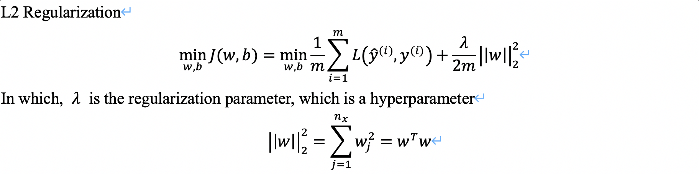
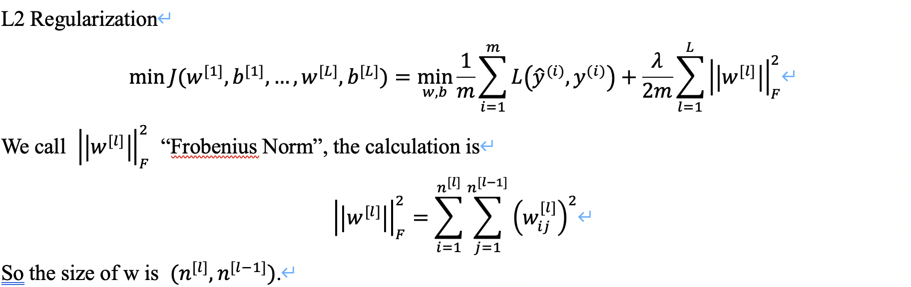
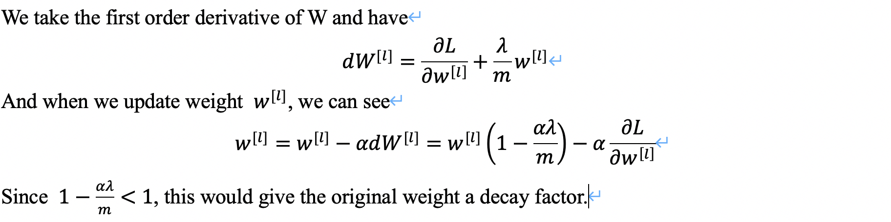

# Improving Deep Neural Networks

## 1. Practical Aspects of Deep Learning
### 1.1 Split data
* We usually split data into **Training**, **Dev** (for Hold-on Cross Validation purposes) and **Testing** datasets.
* When data size is 100, 1,000 or 10,000, we split the data into 60/20/20. However, when this is a big data project where data size is above 1M, the split becomes 98/1/1.
* Make sure training and dev data comes from the same distribution.

### 1.2 Bias-Variance Decomposition
* High bias usually comes from underfitting, which represents for low training data performance. Using a bigger Neural Network or training longer can improve traning data performance.
* High variance usually comves from overfitting, which represents for low dev set performance. Having more data or regularization can improve training data performance.
* **"Bias-Variance Tradeoff"**

### 1.3 Regularization
* For Logistic Regression\
  
* For Neural Network\
  
* Concept of **weight decay**\
  

### 1.4 Dropout
* Randomly dropout a fraction of nodes from each hidden layer in the Neural Network.
* Implementing drop out with Layer 3 and `keep_prob = 0.8`
  ```
  d3 = np.random.rand(a3.shape[0], a3.shape[1]) < keep_prob
  a3 = np.multiply(a3, d3)
  a3 /= keep_prob   ## This setp is called "Inverted Dropout"
  ```

## 1.5 Other Regularization methods
**Data Augmentation** and **Early Stopping**

## 2. Optimization Algorithms

## 3. Hyperparameter Tuning, Batch Normalization and Programming Frameworks