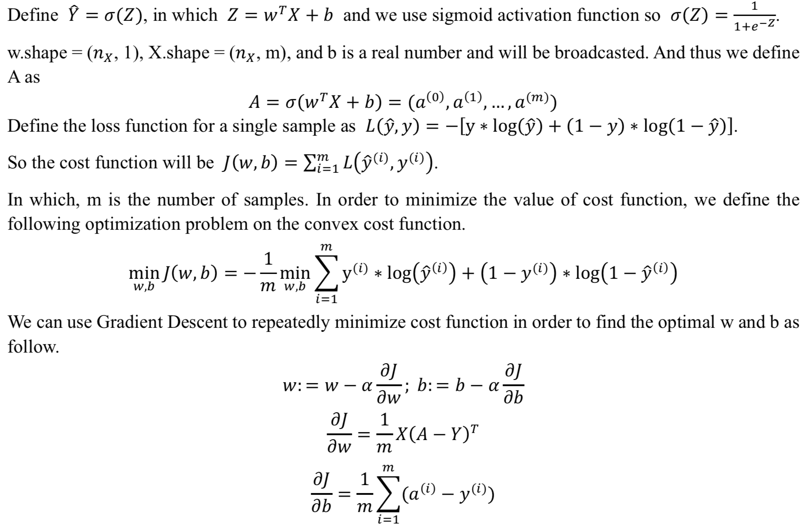
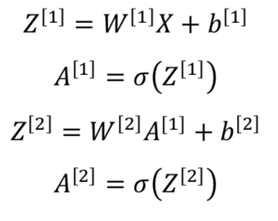
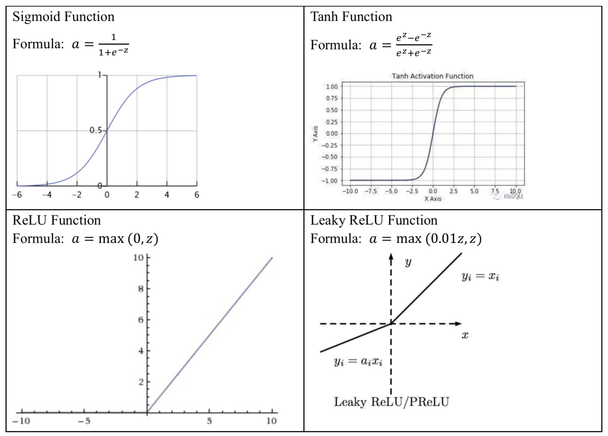
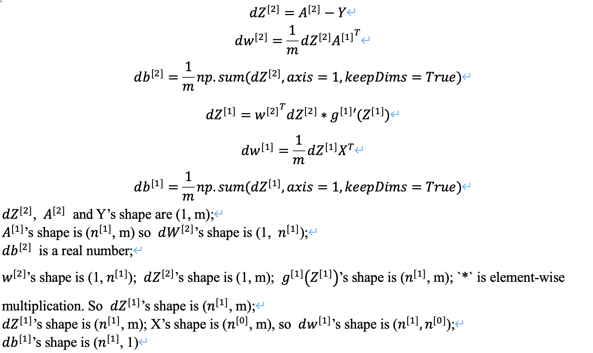
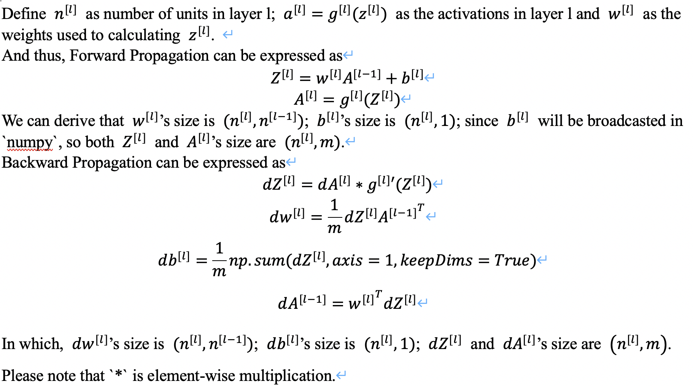

# Neural Networks and Deep Learning

## 1. Neural Network Basics
### 1.1 Mathematics of Logistic Regression
  

### 1.2 Vectorized Implementation in Python for Logistic Regression
  ```python
  for iter in range(NumOfIterations):
    Z = np.dot(w.T, X) + b
    A = sigmoid(Z)
    dZ = A - Z
    dw = 1 / m * np.dot(X, dZ.T)
    db = 1 / m * np.sum(dZ)
    w = w - alpha * dw
    b = b - alpha * db 
  ```

## 2. Shallow Neural Networks
### 2.1 Forward Propagation Formulas
  

### 2.2 Different Common Activation Functions
  

### 2.3 Gradient Descent and Backward Propagation
  

### 2.4 Random Initialization
  All weight variables (`w`) should be initialized as a random between 0 and 1, all drift variables (`b`) should be initialized as 0.

## 3. Deep Neural Network
In this section, we want to expand the one hidden layer Neural Network into a L-hidden layer Neural Network.\
  