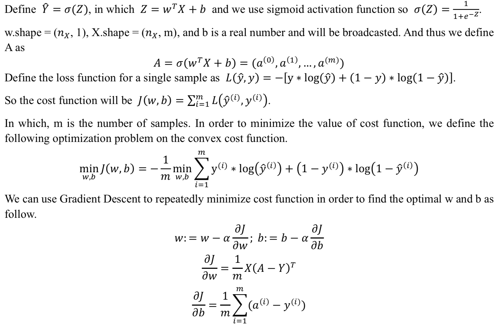

# Neural Networks and Deep Learning

## Neural Network Basics
### Mathematics of Logistic Regression
  

### Vectorized Implementation in Python for Logistic Regression
  ```python
  for iter in range(NumOfIterations):
    Z = np.dot(w.T, X) + b
    A = sigmoid(Z)
    dZ = A - Z
    dw = 1 / m * np.dot(X, dZ.T)
    db = 1 / m * np.sum(dZ)
    w = w - alpha * dw
    b = b - alpha * db 
  ```